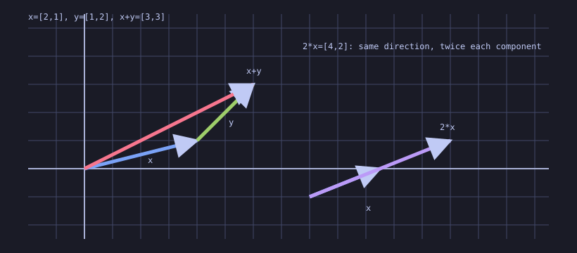
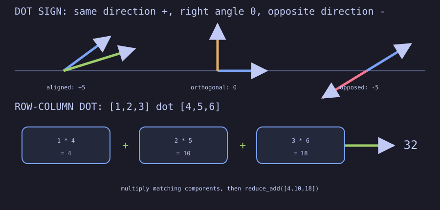
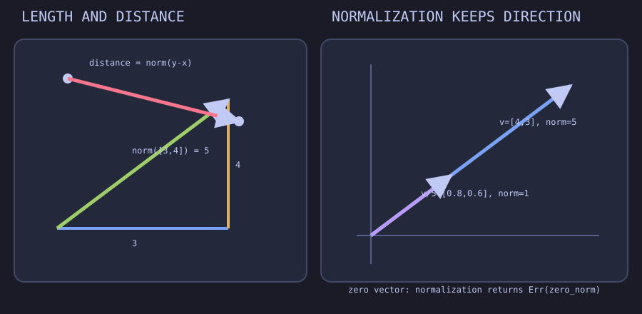
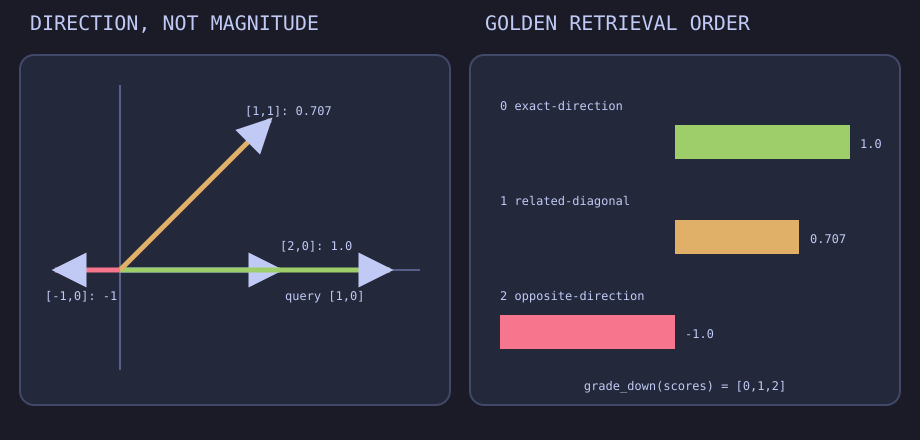

# demo-linear-algebra

Executable, visual linear algebra lessons in sw-MLPL, progressing from feature
vectors and dot products to least squares, PCA, LoRA, and attention.

The repository is both a curriculum and a forcing function: lessons use current
array operations where they are honest, and pin missing general capabilities as
executable upstream blockers instead of hiding them behind compatibility code.

Start with [the syllabus](docs/syllabus.md), read [the implementation
plan](docs/plan.md), and inspect [the measured capability
baseline](docs/capability-baseline.md).

Once the foundation harness is available:

```sh
just check
```

Tests use native mlplunit discovery through `mlplunit.conf`. Set absolute
`MLPL` or `MLPLUNIT` paths to override the documented adjacent development
tools without installing over stable binaries.

## Lesson LA01 — vectors are feature arrays



The rows in the CLI output make componentwise addition authoritative. The
diagram makes the same relationship spatial: placing `y` at the head of `x`
lands at `x+y`, while `2*x` preserves direction and doubles each component.

- [CLI lesson](demos/01-vectors/vector_laws.mlpl)
- [Standalone web lesson](demos/web/vector_laws.mlpl)
- [Native mlplunit coverage](tests/test_vectors.mlpl)

## Lesson LA02 — dot product measures alignment



The upper panel turns the score's sign into visible direction relationships.
The lower panel keeps matrix multiplication honest by exposing each matching
component product—`4`, `10`, and `18`—before their reduction to `32`.

- [CLI lesson](demos/02-dot-product/alignment.mlpl)
- [Standalone web lesson](demos/web/dot_alignment.mlpl)
- [Native mlplunit coverage](tests/test_dot_product.mlpl)

## Lesson LA03 — length, distance, and normalization



The left panel derives length and distance from right-triangle geometry. The
right panel separates direction from magnitude: `v` and `v/norm(v)` point the
same way, while only the latter has unit length. Zero-vector normalization is
explicitly rejected because zero has no direction.

- [CLI lesson](demos/03-norm-distance/normalize.mlpl)
- [Standalone web lesson](demos/web/norm_distance.mlpl)
- [Native mlplunit coverage](tests/test_norm_distance.mlpl)

## Lesson LA04 — cosine similarity and retrieval



Cosine divides dot alignment by both magnitudes. The left panel shows why a
longer same-direction embedding still scores `1`; the right panel pins the
deterministic retrieval order `[0,1,2]` for exact, diagonal, and opposed
candidates.

- [CLI lesson](demos/04-cosine-similarity/retrieval.mlpl)
- [Standalone web lesson](demos/web/cosine_retrieval.mlpl)
- [Native mlplunit coverage](tests/test_cosine_similarity.mlpl)
