# demo-linear-algebra

Executable, visual linear algebra lessons in sw-MLPL, progressing from feature
vectors and dot products to least squares, PCA, LoRA, and attention.

The repository is both a curriculum and a forcing function: lessons use current
array operations where they are honest, and pin missing general capabilities as
executable upstream blockers instead of hiding them behind compatibility code.

Start with [the syllabus](docs/syllabus.md), read [the implementation
plan](docs/plan.md), and inspect [the measured capability
baseline](docs/capability-baseline.md).

The first six-lesson unit is complete; see its [acceptance
report](docs/foundation-acceptance.md). The matrix unit is also complete; see
its [acceptance report](docs/matrix-acceptance.md). Systems, rank, and
conditioning are accepted in [the systems report](docs/systems-acceptance.md).
Factorizations are accepted in [the factorization report](docs/factorization-acceptance.md),
with LA16 constrained by B3. The measured
[linear-algebra-for-ML saga](docs/ml-payoff-saga.md) is active, and LA19 is
the first runnable payoff.

Once the foundation harness is available:

```sh
just check
```

Tests use native mlplunit discovery through `mlplunit.conf`. Set absolute
`MLPL` or `MLPLUNIT` paths to override the documented adjacent development
tools without installing over stable binaries.

## Lesson LA01 — vectors are feature arrays


The rows in the CLI output make componentwise addition authoritative. The
diagram makes the same relationship spatial: placing `y` at the head of `x`
lands at `x+y`, while `2*x` preserves direction and doubles each component.

- [CLI lesson](demos/01-vectors/vector_laws.mlpl)
- [Standalone web lesson](demos/web/vector_laws.mlpl)
- [Native mlplunit coverage](tests/test_vectors.mlpl)

## Lesson LA02 — dot product measures alignment


The upper panel turns the score's sign into visible direction relationships.
The lower panel keeps matrix multiplication honest by exposing each matching
component product—`4`, `10`, and `18`—before their reduction to `32`.

- [CLI lesson](demos/02-dot-product/alignment.mlpl)
- [Standalone web lesson](demos/web/dot_alignment.mlpl)
- [Native mlplunit coverage](tests/test_dot_product.mlpl)

## Lesson LA03 — length, distance, and normalization


The left panel derives length and distance from right-triangle geometry. The
right panel separates direction from magnitude: `v` and `v/norm(v)` point the
same way, while only the latter has unit length. Zero-vector normalization is
explicitly rejected because zero has no direction.

- [CLI lesson](demos/03-norm-distance/normalize.mlpl)
- [Standalone web lesson](demos/web/norm_distance.mlpl)
- [Native mlplunit coverage](tests/test_norm_distance.mlpl)

## Lesson LA04 — cosine similarity and retrieval


Cosine divides dot alignment by both magnitudes. The left panel shows why a
longer same-direction embedding still scores `1`; the right panel pins the
deterministic retrieval order `[0,1,2]` for exact, diagonal, and opposed
candidates.

- [CLI lesson](demos/04-cosine-similarity/retrieval.mlpl)
- [Standalone web lesson](demos/web/cosine_retrieval.mlpl)
- [Native mlplunit coverage](tests/test_cosine_similarity.mlpl)

## Lessons LA05–LA06 — span and projection

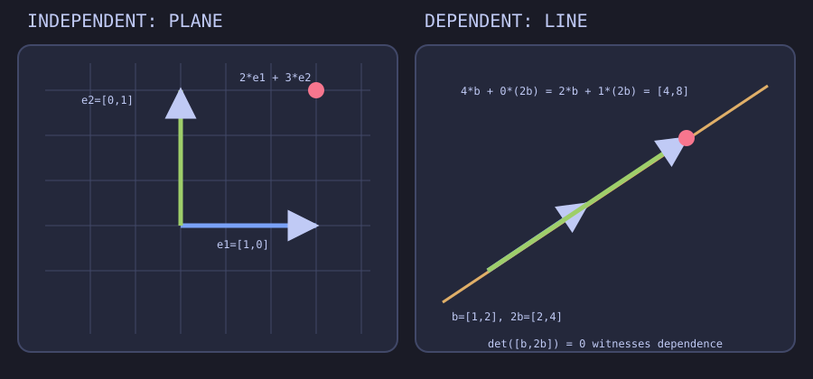

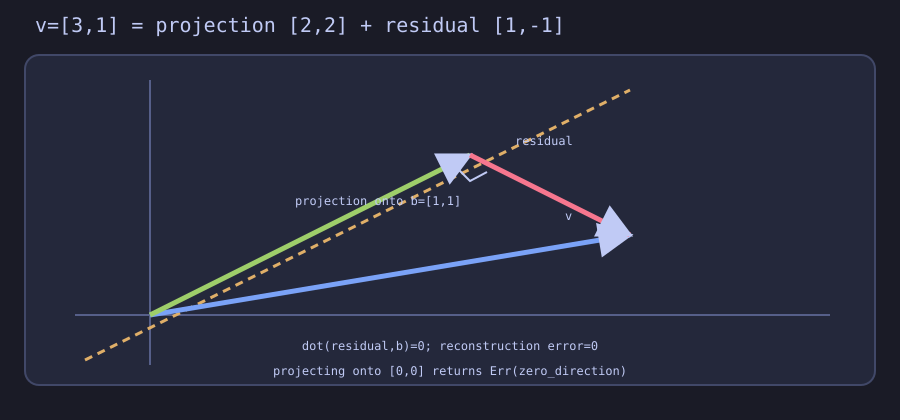

LA05 contrasts two independent directions with a dependent pair whose
determinant is zero and whose coordinates are non-unique. LA06 turns that span
into a decomposition: the projection lies in `span(b)`, the residual is
orthogonal to `b`, and the two reconstruct the original vector.

- [LA05 CLI](demos/05-span/combinations.mlpl) and [web](demos/web/span.mlpl)
- [LA06 CLI](demos/06-projection/shadow.mlpl) and [web](demos/web/projection.mlpl)
- [Native mlplunit coverage](tests/test_span_projection.mlpl)

## Lesson LA07 — matrices transform basis directions

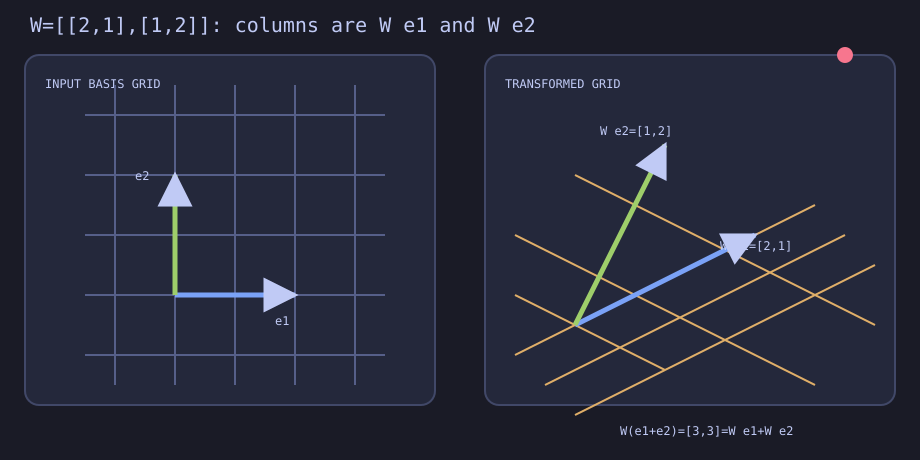

For `W:[output,input]`, each column is where one input basis direction lands,
and each row computes one output coordinate. The checked 2D fixture maps
`e1` to `[2,1]` and `e2` to `[1,2]`, so their combinations form the slanted
grid while the origin remains fixed.

- [CLI lesson](demos/07-matrix-transform/basis_grid.mlpl)
- [Standalone web lesson](demos/web/matrix_basis.mlpl)
- [Native mlplunit coverage](tests/test_matrix_transform.mlpl)

## Lesson LA08 — matrix multiplication is row-column dots

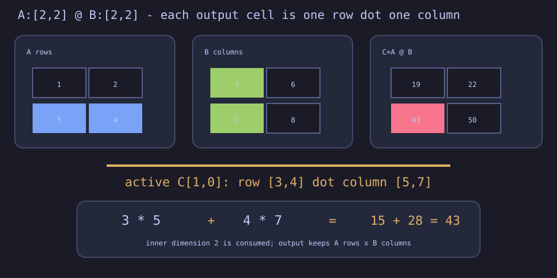

For `A:[rows,inner] @ B:[inner,columns]`, each output cell is one left row
dotted with one right column. The lesson derives all four cells of a 2×2
product, exposes the `15 + 28 = 43` accumulator, and independently checks the
result against native rank-2 `matmul`.

- [CLI lesson](demos/08-matrix-multiplication/row_column.mlpl)
- [Standalone web lesson](demos/web/row_column_matmul.mlpl)
- [Native mlplunit coverage](tests/test_matrix_multiplication.mlpl)

## Lesson LA09 — composition and transpose

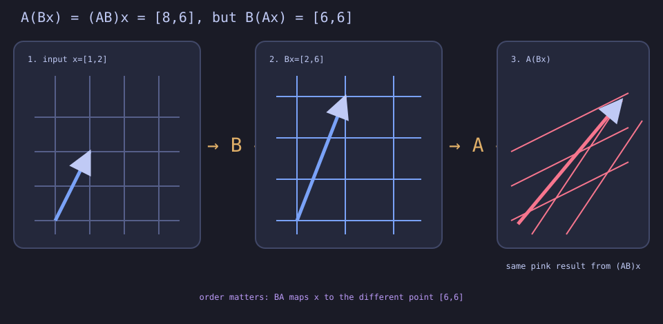

The exact fixture verifies `A(Bx)=(AB)x=[8,6]`. Named axes reject the invalid
`B@A` order, while positional copies make `B(Ax)=[6,6]` a visible numeric
counterexample. It also checks double transpose,
`(AB)^T=B^T A^T`, and the semantic axis transition from `output,input` to
`input,output`.

- [CLI lesson](demos/09-composition-transpose/successive.mlpl)
- [Standalone web lesson](demos/web/composition_transpose.mlpl)
- [Native mlplunit coverage](tests/test_composition_transpose.mlpl)

## Lesson LA10 — signed area and singularity

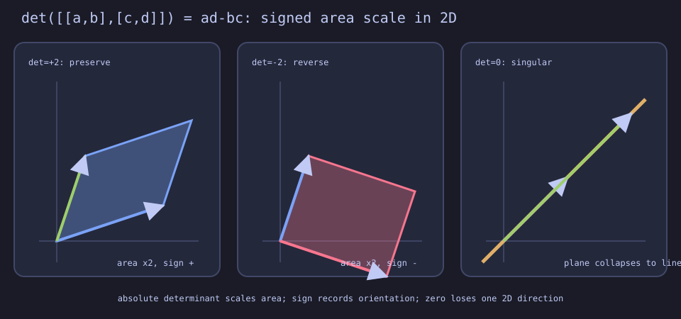

The bounded `[2,2]` formula `ad-bc` distinguishes preserved orientation,
reversed orientation, and zero-area collapse. The singular fixture maps two
distinct inputs to `[2,4]`, making lost direction visible without pretending
the repository has a general determinant or inverse primitive.

- [CLI lesson](demos/10-determinant-area/signed_area.mlpl)
- [Standalone web lesson](demos/web/signed_area.mlpl)
- [Native mlplunit coverage](tests/test_determinant2.mlpl)

## Matrix payoff — a dense layer

The integration demo computes `XW+b` with axes
`[sample,feature] @ [feature,output] + [output] -> [sample,output]`. It checks
native rank-2 multiplication against LA08's derived dots before broadcasting
the bias, connecting the matrix unit directly to learned feature transforms.

- [CLI payoff](demos/00-matrix-payoff/dense_layer.mlpl)
- [Native mlplunit coverage](tests/test_dense_layer.mlpl)

## Lesson LA11 — bounded linear systems

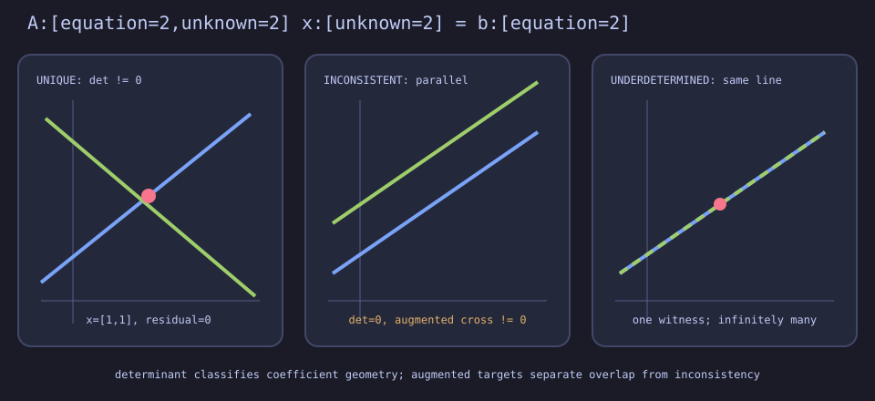

For exactly two equations in two unknowns, determinant and augmented-target
cross-products classify a unique intersection, parallel inconsistency, or
coincident underdetermination. Candidates are verified through an independent
`Ax-b` residual calculation.

- [CLI lesson](demos/11-linear-systems/intersections.mlpl)
- [Standalone web lesson](demos/web/linear_systems.mlpl)
- [Native mlplunit coverage](tests/test_systems2.mlpl)

## Lesson LA12 — elimination and rank

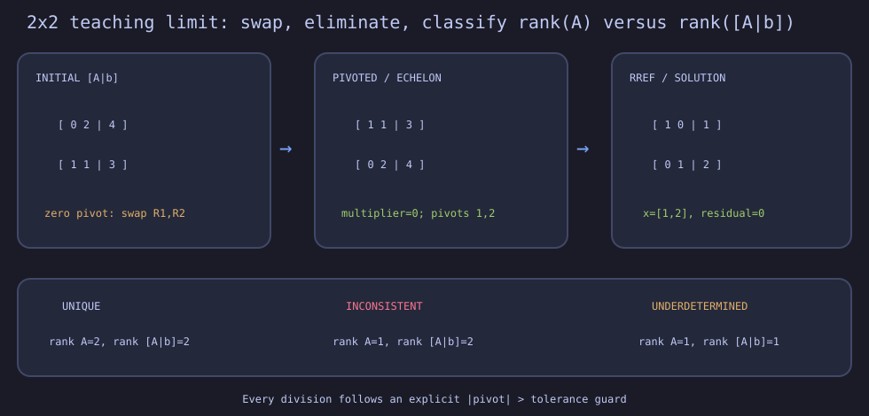

The bounded trace turns `[A|b]` into visible row-operation states, guarding
every pivot before division. Coefficient and augmented rank pairs distinguish
unique, inconsistent, and underdetermined systems without presenting this
2×2 teaching algorithm as a production solver.

- [CLI lesson](demos/12-elimination/row_reduction.mlpl)
- [Standalone web lesson](demos/web/elimination.mlpl)
- [Native mlplunit coverage](tests/test_elimination2.mlpl)

## Lesson LA13 — conditioning and reliability

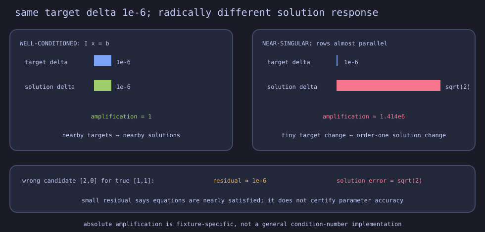

An identity control has perturbation amplification one. An almost singular
system amplifies the same `10⁻⁶` target change by more than one million, and
a separate wrong candidate demonstrates why a tiny residual does not certify
an accurate parameter vector.

- [CLI lesson](demos/13-conditioning/perturbations.mlpl)
- [Standalone web lesson](demos/web/conditioning.mlpl)
- [Native mlplunit coverage](tests/test_conditioning2.mlpl)

## Lesson LA14 — classical Gram–Schmidt

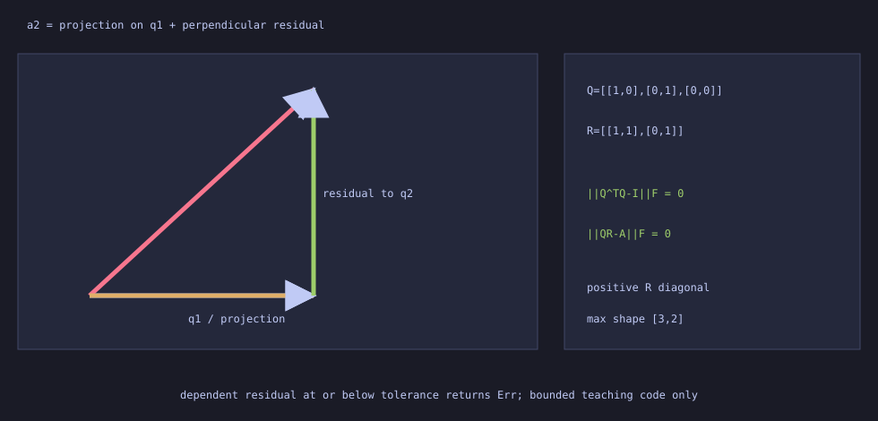

The checked three-by-two fixture exposes every subtraction that creates the
second orthogonal direction. `Q^TQ-I` and `QR-A` are measured independently;
dependent columns return an error at the stated tolerance.
The QR comparison also admits a near-dependent fixture only under an explicitly
tiny threshold: reconstruction is zero while orthogonality error is about
`1.11e-3`, demonstrating why both diagnostics matter.

- [CLI lesson](demos/14-gram-schmidt/projection_subtraction.mlpl)
- [Standalone web lesson](demos/web/gram_schmidt.mlpl)
- [Native mlplunit coverage](tests/test_gram_schmidt2.mlpl)

## Lesson LA15 — bounded power iteration

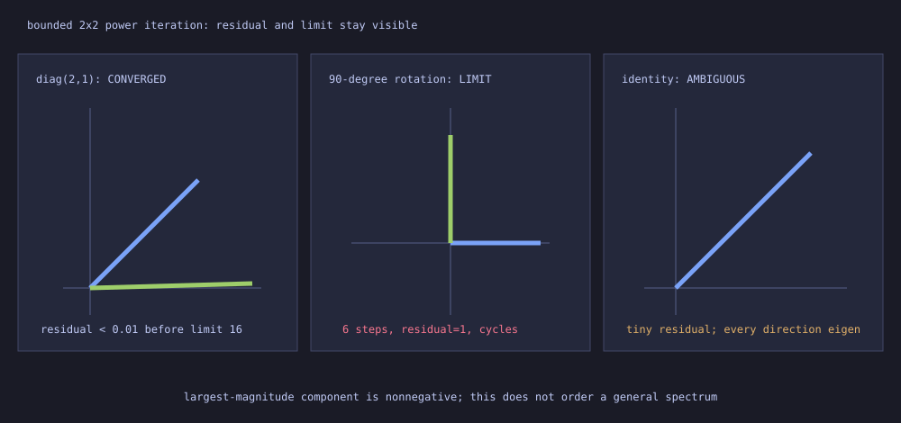

The lesson keeps the Rayleigh value, eigenpair residual, iteration count, hard
limit, and deterministic sign policy visible. A rotation reaches the limit
with residual one; identity has a tiny residual without a unique dominant
direction.

- [CLI lesson](demos/15-power-iteration/dominant_direction.mlpl)
- [Standalone web lesson](demos/web/power_iteration.mlpl)
- [Native mlplunit coverage](tests/test_power_iteration2.mlpl)

## Lesson LA16 — SVD and low-rank reconstruction (constrained)

LA16 is intentionally blocked by the verified SVD-specific B3 contract. The
configured runtime reports `unknown function: svd`; hand-authored factors or
power-iteration deflation would not honestly define ordering, paired signs,
rectangular shapes, or repeated/zero singular values. See the
[executable blocker decision](docs/svd-blocker-decision.md).

## Lesson LA17 — least-squares regression (constrained)

LA17 remains behind verified blocker B2. The runtime still has no stable
general `solve(A,B)` path, and neither normal equations nor the bounded LA11
2x2 teaching solver provides an honest production regression foundation. See
the [executed LA17 gate](docs/la17-least-squares-gate.md).

## Lesson LA19 — bounded LoRA low-rank update

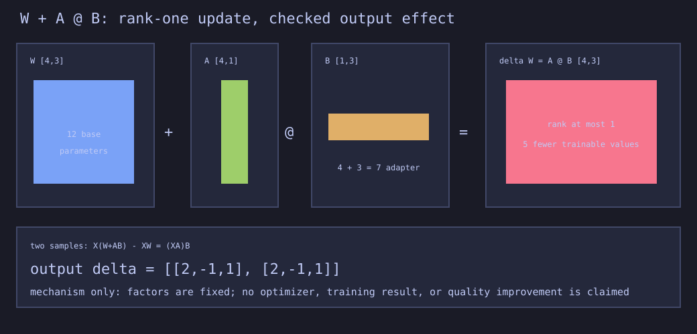

The checked fixture keeps `W` fixed and constructs `A@B`, comparing 12 base
values with 7 adapter values. It verifies the nonzero output identity
`X(W+AB)-XW=(XA)B` while explicitly making no training or quality claim.

- [CLI lesson](demos/19-lora/low_rank_update.mlpl)
- [Standalone web lesson](demos/web/lora.mlpl)
- [Native mlplunit coverage](tests/test_lora.mlpl)

## Lesson LA20 — bounded single-head attention

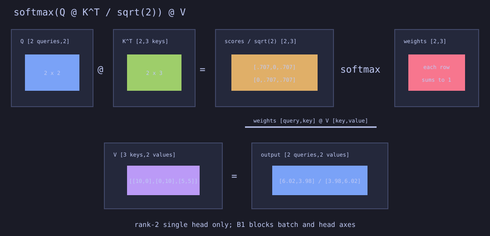

The rank-2 lesson exposes `QK^T/sqrt(d)`, native stable row softmax, and
weighted value mixing. Every weight row sums to one. B1 remains visible for
batch and head axes rather than being hidden behind explicit compatibility loops.

- [CLI lesson](demos/20-attention/single_head.mlpl)
- [Standalone web lesson](demos/web/attention.mlpl)
- [Native mlplunit coverage](tests/test_attention.mlpl)
